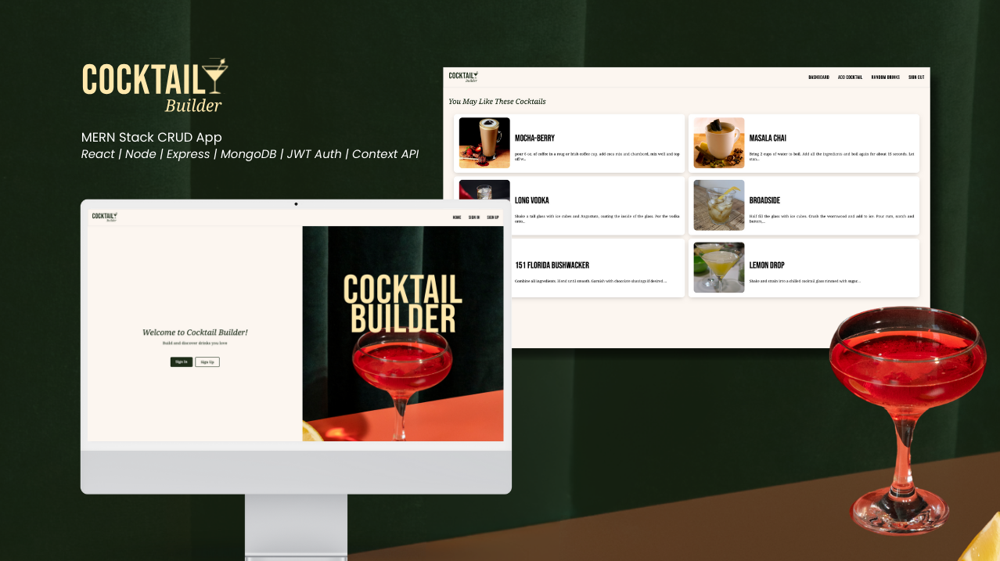

# 🍸 Cocktail Builder 

### 🍹 Build and discover drinks you love

Welcome to Cocktail Builder, a full-stack MERN application for creating and discovering custom cocktail recipes. Users can sign up, log in, and build their own drink creations—or explore a list of random cocktails for inspiration!

Our team of three wanted to build a creative, personalized app that lets users explore and document cocktail recipes. We collaborated on both the frontend and backend.

## 📸 Screenshot

## 🚀 Live Demo
[📝 Try Cocktail Builder Here](https://placehold.co/)

## 🧭 Navigation & Features
- Landing page for guest users
- Sign Up / Sign In pages with secure form validation

Dashboard with:
- Personalized greeting
- Search bar
- Category links (Add Drink, Random, Favorites, Popular)
- Random cocktail recommendations

Add Drink form with:
- Custom ingredients
- Unit and glassware dropdowns
- Directions field

## 🎨 Planning Materials
We used [Figma](https://www.figma.com/design/0wn8PXxEaKEn148ovLZarL/Cocktail-Builder-App?node-id=63-120&t=fqpVLOUCcquVKavF-1) (view the board) to plan the look and feel of the website, and [Trello](https://trello.com/invite/b/67f00fd1b4f9f732341a7af5/ATTI7c85234dd070e10faa3a2e8b369b6f42B59E8884/basic-board) to manage the development process. 

## 🛠️ Technologies Used
Frontend:
- React
- React Router DOM
- Context API
- CSS Flexbox and Grid

Backend: 
[View Backend Repo Here:](https://github.com/suleecao/cocktail-builder-backend)
- Node.js
- Express.js
- MongoDB
- Mongoose

## 🔐 Auth & Security
- JWT-based user authentication
- Password hashing with bcrypt
- Protected routes for authorized users

## 📝 Sources & Credits
- The fonts are from Google Fonts
- Photos and icons are from [Canva](https://www.canva.com)

## 🔮 Future Improvements
🔹 Allow users to upload cocktail images

🔹 Ability to filter cocktails based on tags
